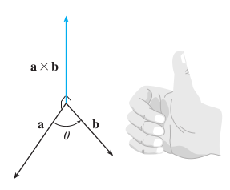
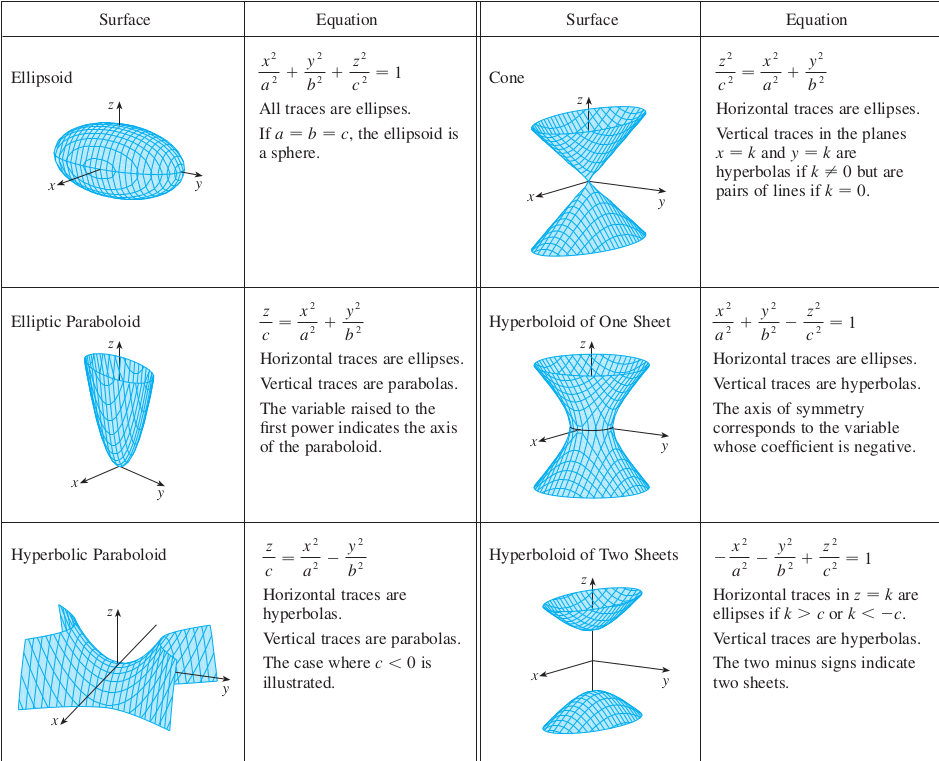

# 10.3 向量的点积 THE DOT PRODUCT

## 向量投影
- 向量的标量投影 (scalar projection of $\vec{b}$ onto $\vec{a}$ ) $$comp_{\vec{a}}\vec{b} = \frac{\vec{a}\cdot\vec{b}}{|\vec{a}|}$$
- 向量的向量投影 (vector projection of $\vec{b}$ onto $\vec{a}$ ) $$proj_{\vec{a}}\vec{b} = \frac{\vec{a}\cdot\vec{b}}{|\vec{a}|^2}\vec{a}$$

# 10.4 向量的叉积 THE CROSS PRODUCT

## 自信数学人

## 向量平行的充要条件
- $$a\times b = 0$$

## 叉积的性质
- $$a\times(b+c) = a\times b + a\times c$$
- $$a\cdot(b\times c) = (a\times b)\cdot c$$
- $$a\times(b\times c) = (a\cdot c)b - (a\cdot b)c$$
- $$(a\times b)\times c = (a\cdot c)b - (b\cdot c)a$$

## 三重标量积
- Triple scalar product: $$a\cdot(b\times c) = b\cdot(c\times a) = c\cdot(a\times b)$$

## 力矩
- Torque: $$\tau = r\times F$$

# 10.5 线和平面方程 EQUATIONS OF LINES AND PLANES

## 直线
- 点向式方程 Point-direction
$$\vec{r} = \vec{r}_0 + t\vec{v}$$

$$<x,y,z> = <x_0,y_0,z_0> + t<a,b,c>$$

$$\begin{cases}
x = x_0 + at\\
y = y_0 + bt\\
z = z_0 + ct
\end{cases}$$

- 对称方程 Symmetric equations
$$\frac{x-x_0}{a} = \frac{y-y_0}{b} = \frac{z-z_0}{c}$$

- 线段方程 line segment equation
$$\vec{r} = (1-t)\vec{r}_0 + t\vec{r}_1$$
$$\vec{r} = \vec{r}_0 + t(\vec{r}_1 - \vec{r}_0)$$

## 平面
- 点法式方程 Point-normal form
$$\vec{n}\cdot(\vec{r}-\vec{r}_0) = 0$$
$$\vec{n}\cdot\vec{r} = \vec{n}\cdot\vec{r}_0$$
$$a(x-x_0) + b(y-y_0) + c(z-z_0) = 0$$

- 法向量 normal vector ( $\vec{n}$ )
$$\vec{n} = <a,b,c> = \vec{u}\times\vec{v}$$
( $\vec{u}$ and $\vec{v}$ are nonparallel vectors in the plane )

- 点到平面的距离
$$d = \frac{|\vec{n}\cdot(\vec{r}-\vec{r}_0)|}{|\vec{n}|}$$
$$d = \frac{|ax_0+by_0+cz_0+d|}{\sqrt{a^2+b^2+c^2}}$$

# 10.6 柱面和二次曲面 CYLINDERS AND QUADRIC SURFACES

- Words

| English | Chinese | meaning |
| :-----: | :-----: | :-----: |
| cylinder | 柱面 | 只含有xyz其中的两个变量的方程 |
| traces | 截痕 | 与坐标轴平行的截痕 |
| ruling | 母线 | 柱面上与坐标轴平行的直线 |
| quadric surface | 二次曲面 | 分为两类：  $Ax^2+By^2+Cz^2+J=0$   $Ax^2+By^2+Cz^2+Iz=0$ |
| ellipsoid | 椭球面 | $Ax^2+By^2+Cz^2+J=0$ |
| hyperboloid of one sheet | 单叶双曲面 | $Ax^2+By^2-Cz^2+J=0$ |
| hyperboloid of two sheets | 双叶双曲面 | $Ax^2-By^2-Cz^2+J=0$ |
| elliptic paraboloid | 椭圆抛物面 | $Ax^2+By^2+Iz=0$  |
| hyperbolic paraboloid | 双曲抛物面(马鞍面) | $Ax^2-By^2+Iz=0$ |
| elliptic cone | 椭圆锥面 | $Ax^2+By^2-Cz^2=0$ |

-Graphs of Quadric Surfaces

# 10.7 矢量函数和空间曲线 VECTOR FUNCTIONS AND SPACE CURVES

## 单词

| English | Chinese | meaning |
| :-----: | :-----: | :-----: |
| vector-valued function | 矢量函数 |  |
| component functions | 分量函数 | $r(t) = <f(t),g(t),h(t)> = f(t)\vec{i} + g(t)\vec{j} + h(t)\vec{k}$ |
| space curve | 空间曲线 |  |
| parametric equations | 参数方程 | $x = f(t),y = g(t),z = h(t)$ |
| parameter | 参数 | 指$t$ |
| helix | 螺旋线 | $\vec{r}(t) = <\cos t,\sin t,t>$ |
| toroidal spiral | 圆环螺旋线 | $\vec{r}(t) = <(a+b\cos t)\cos t,(a+b\cos t)\sin t,b\sin t>$ |

- 矢量函数的极限
$$\lim_{t\to t_0}r(t) = <\lim_{t\to t_0}f(t),\lim_{t\to t_0}g(t),\lim_{t\to t_0}h(t)>$$

- 矢量函数在$t_0$处连续
$$\lim_{t\to t_0}r(t) = r(t_0)$$

- 矢量函数的导数
$$r'(t) = <f'(t),g'(t),h'(t)>$$

- 矢量函数的积分
$$\int r(t)dt = <\int f(t)dt,\int g(t)dt,\int h(t)dt>$$

# 10.8 弧长和曲率 ARC LENGTH AND CURVATURE

| English | Chinese | formula |
| :-----: | :-----: | :-----: |
| tangent vector | 切向量 | $\vec{r}'(t) = <x'(t),y'(t),z'(t)>$ |
| tangent line | 切线 | $\vec{r}(t) = \vec{r}_0 + t\vec{r}'(t)$ |
| unit tangent vector | 单位切向量 | $\vec{T}(t) = \frac{\vec{r}'(t)}{\|\vec{r}'(t)\|}$ |

## 弧长
- $$L = \int_a^b|\vec{r}'(t)|dt$$
- arc length function: $$s(t) = \int_a^t|\vec{r}'(u)|du$$

## 曲率
- $$\kappa(t) = \frac{|T'(t)|}{|\vec{r}'(t)|}$$
- $$\kappa(t) = \frac{|\vec{r}'(t)\times\vec{r}''(t)|}{|\vec{r}'(t)|^3}$$
- $$\kappa(x) = \frac{|f''(x)|}{[1+(f'(x))^2]^{3/2}}$$

## 法向量
- $$\vec{N}(t) = \frac{\vec{T}'(t)}{|\vec{T}'(t)|}$$
- $$\vec{B}(t) = \vec{T}(t)\times\vec{N}(t)$$