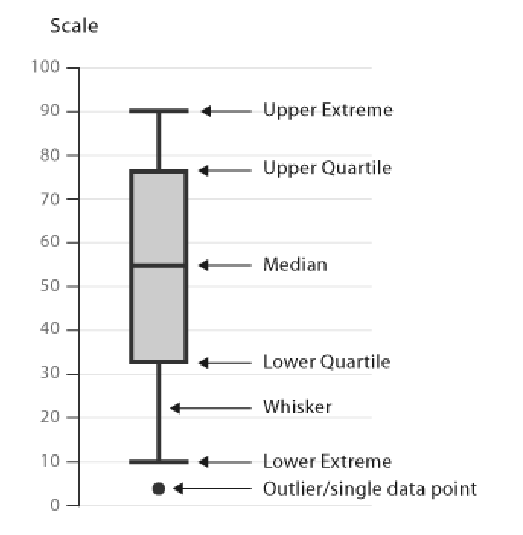
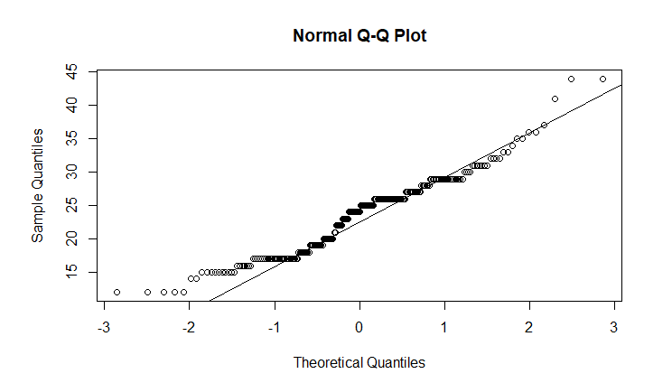

# 1 Random sampling (随机抽样)
- population (总体)
- sample (样本)
- bias (偏差)
- biased sample (有偏样本)：不是随机抽样
- random sample (随机样本)：每个样本都有相同的机会被选中
# 2 Scatter plots (散点图)
- regression (回归)
- 如何画散点图
  ```R
  rx=c(1, 2, 3, 4)
  ry=c(3,4,2,6)

  plot(rx,ry,main = paste("Scatter plot"))
  ```
- measures of sample (样本的测量)
  - parameter (参数)：如μ、σ
  - statistic (统计量)：如x̄、s
- statistics (统计量)是用来估计parameter (参数)的
# 3 Location measures (位置测量)
- mean (均值)
- median (中位数)
- mode (众数)
- how to select a location measure (如何选择位置测量)
  - categorical data (分类数据)：mode (众数)
  - with skewed data (偏态数据)：median (中位数)
  - otherwise (其他情况)：mean (均值)
- 代码：
  ```R
  mean(x) # 均值
  median(x) # 中位数
  getmode <- function(v) {
   uniqv <- unique(v)
   uniqv[which.max(tabulate(match(v, uniqv)))]
  }
  getmode(x) # 众数
  ```
# 4 Variability measures (变异测量)
- variability (变异性)
- dispersion (离散程度)
- deviate (偏差)
- variance (方差)
  - σ² = Σ(xᵢ - μ)² / n
  - s² = Σ(xᵢ - x̄)² / (n-1)
- 代码：
  ```R
  var(x) # 方差
  sd(x) # 标准差
  ```
- 贝塞尔校正 (Bessel's correction)
  - 用来校正样本方差的无偏估计
  - 用n-1来代替n
- range (极差)
- Quartile (四分位数)
  - Q1 (第一四分位数) (lower quartile)
  - Q2 (第二四分位数) (median)
  - Q3 (第三四分位数) (upper quartile)
- Interquartile range (四分位数间距) (IQR)
  - midspread (中间距离)
  - IQR = Q3 - Q1
  - outlier (离群值)
    - 离群值的判断
      - Q1 - 1.5 * IQR > xᵢ
      - Q3 + 1.5 * IQR < xᵢ
- 代码：
  ```R
  quantile(x, probs = seq(0.25, 0.75, 0.25)) # 25%、50%、75%分位数
  IQR(x) # 四分位数间距
  summary(x) # 最小值、第一四分位数、中位数、第三四分位数、最大值  
  ```
# 5 Box and whisker plots (箱线图)
- boxplot (箱线图)
- whisker (须)
- 代码：
  ```R
  boxplot(x, main = "Box plot", ylab = "Value")
  ```
  
# 6 Correlation analysis (相关分析)
- Pearson’s correlation coefficient (皮尔逊相关系数)
  - $$r = \frac{Σ(x_i - x̄)(y_i - ȳ)}{\sqrt{Σ(x_i - x̄)²Σ(y_i - ȳ)²}}$$
  - $$r = \frac{1}{n-1}Σ(\frac{x_i - x̄}{s_x})(\frac{y_i - ȳ}{s_y})$$
  - $-1 ≤ r ≤ 1$
  - $r = 0$：无线性关系
  - $r > 0$：正线性关系
  - $r < 0$：负线性关系
- Pearson’s correlation coefficient (皮尔逊相关系数)和Spearman’s correlation coefficient (斯皮尔曼相关系数)的区别
  - 皮尔逊相关系数是用来衡量两个变量之间的**线性**关系的，斯皮尔曼相关系数是用来衡量两个变量之间的单调关系的
  - 皮尔逊相关系数可能会受到**离群值**的影响，斯皮尔曼相关系数不会
- 代码：
  ```R
  cor(x, y, method = "pearson") # 皮尔逊相关系数
  cor(x, y, method = "spearman") # 斯皮尔曼相关系数
  rank(x) # 排序
  acf(x) # 画自相关图
  ```
# 7 Spearman’s correlation coefficient (斯皮尔曼相关系数)
- Spearman’s correlation coefficient (斯皮尔曼相关系数)
  - 斯皮尔曼相关系数是先对原始数据进行排序，然后计算排序后的数据的皮尔逊相关系数
- 数据处理方法
  - 如果数据是相关的，那么我们可以关注集中趋势，而忽略离群值
  - 如果数据是无关的，我们可以重新考虑数据的收集方式
    - Method of replication (复制法)
    - 进行更多的实验
    - Method of batch means (批量平均法)
    - 将数据分成多个批次，然后计算每个批次的平均值
# 8 Shape measures (形状测量)
- skewness (偏度)
  - $$skewness = \frac{Σ(x_i - x̄)³}{(n-1)s^3}$$
  - $skewness = 0$：symmetric (对称)
  - $skewness > 0$：right-skewed (右偏)
  - $skewness < 0$：left-skewed (左偏)
- kurtosis (峰度)
  - $$kurtosis = \frac{Σ(x_i - x̄)⁴}{(n-1)s^4} - 3$$
  - $kurtosis = 3$：mesokurtic (中峰) (normal distribution)
  - $kurtosis > 3$：leptokurtic (尖峰) (heavy-tailed distribution)
  - $kurtosis < 3$：platykurtic (平峰) (light-tailed distribution)
# 9 Histograms (直方图)
- histogram (直方图)
- cell width (组距) = (max - min) / number of cells
- frequency (频率) = number of observations in cell / total number of observations
- Sturges’ rule (斯特吉斯法则)
  - number of cells = 1 + log₂n = 1 + 3.322log₁₀n (在R中默认使用的方法)
# 10 Quantile and probability plots (分位数和概率图)
- quantile (分位数) 用 q(f) 表示
  - q(0.25) = Q1 (第一四分位数)
  - $$f_i = \frac{i - \frac{3}{8}}{n + \frac{1}{4}}$$
  - f_i：第i个分位数，i = 1, 2, ..., n
  - 这个公式的意思是：第一个分位数是0.25，第二个分位数是0.5，第三个分位数是0.75，以此类推
  - 例如，当n = 4时，f = (0.125, 0.375, 0.625, 0.875)
  - 又例如，当n = 5时，f = (0.1, 0.3, 0.5, 0.7, 0.9)
  - percentile (百分位数)：q(0.01), q(0.02), ..., q(0.99)
- Normal Q-Q plot (正态概率图)
  - normal q-q plot 是用来检验数据是否服从正态分布的
  - 如果数据服从正态分布，那么normal q-q plot应该是一条直线
  - 代码：
    ```R
    qqnorm(x) # 正态概率图
    qqline(x) # 画直线
    ```
    
# 11 Maximum likelihood method (最大似然法)
- likelihood function (似然函数)
  - $$L(θ) = Πf(x_i;θ)$$
  - θ：参数
  - xᵢ：样本
  - f(xᵢ;θ)：概率密度函数0
- log-likelihood function (对数似然函数)
  - $$l(θ) = logL(θ) = Σlogf(x_i;θ)$$
  - θ：参数
  - xᵢ：样本
  - f(xᵢ;θ)：概率密度函数
- maximum likelihood estimator (最大似然估计)
  - $$\frac{∂l(θ)}{∂θ} = 0$$
- 代码：
  ```R
  mle(x, distr, start = list()) # 最大似然估计
  ```